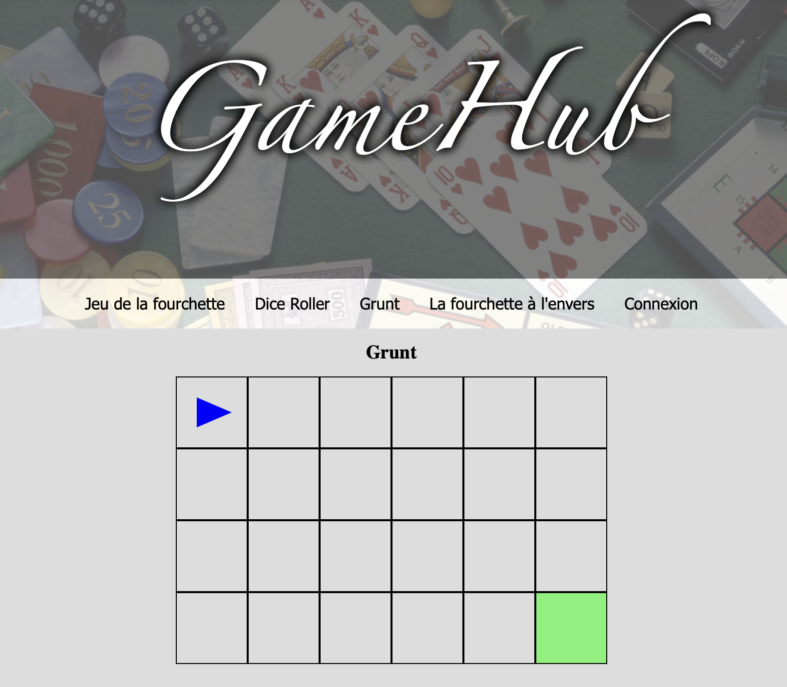

# Challenge GameHub
Ce projet est un challenge que j'ai effectué pendant ma [formation O'Clock](https://oclock.io/formations/developpeur-web-fullstack-javascript), durant la troisième "saison".\
Il s'agissait de développer une plateforme web pour centraliser différents jeux créés pendant la formation, avec **Express.js** et **EJS**.



## Technologies

- EJS
- CSS
- Javascript
- Express.js

## Installation

```
git clone https://github.com/Nina-petit/Formation-Gamehub.git
cd Formation-GameHub
npm install
node index.js
```
Puis allez sur `localhost:4000`

## Fonctionnalités

- Jeu de la fourchette: on doit trouver, grâce à un input, le nombre auquel le programme pense. Il nous dit si c'est plus ou moins à chaque essai.
- Dice roller: on choisit le nombre de dés qu'on veut lancer grâce à un slider, puis, en affrontant un deuxième joueur, celui qui a le plus grand score marque un point.
- Grunt: grâce au clavier, on doit diriger la flèche du départ jusqu'à l'arrivée.
- La fourchette à l'envers: on doit faire deviner au programme le nombre auquel on pense, en lui indiquant si c'est plus ou moins à chaque essai.
